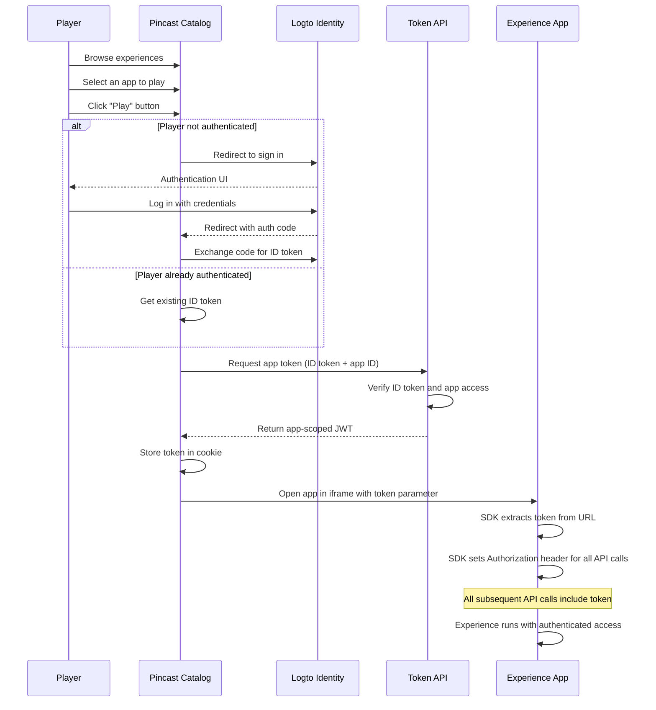

# Player Authentication Flow

This document outlines the authentication flow for players accessing Pincast experiences.

## Overview

Pincast uses a token-based authentication system with the following components:

- **Logto Identity Provider**: Handles user registration and authentication
- **App-scoped JWT tokens**: Provides secure access to specific experiences
- **Cookie & localStorage storage**: Maintains token persistence across sessions
- **SDK token interceptor**: Automatically adds tokens to API requests

## Authentication Flow Diagram



## Token Exchange Process

1. **User Authentication**:
   - Player logs in via Logto
   - Catalog receives and stores ID token

2. **App Token Request**:
   - Catalog sends ID token + app ID to `/api/token/app` endpoint
   - API verifies ID token and checks if app is published
   - API creates a new app-scoped JWT with:
     - `sub`: Player's user ID
     - `aud`: `app:{appId}` (audience for specific app)
     - `role`: "player"
     - Expiration: 1 hour

3. **Token Delivery**:
   - Token is stored in client cookie
   - App URL is opened with token as query parameter
   - SDK automatically extracts token and configures all future requests

## Security Considerations

- Tokens are short-lived (1 hour) to limit exposure
- App-specific audience ensures tokens can't be used across apps
- All API calls within the experience require valid tokens
- Tokens are transmitted over HTTPS only
- Admin approval process ensures only valid apps are published

## Implementation Notes

- Token generation: `server/api/token/app.post.ts`
- Token storage: `composables/usePlayerToken.ts`
- Token interception: `packages/sdk/src/runtime/token.ts`
- Experience iframe: `pages/apps/[slug].vue`

## Testing

The token exchange process can be tested:

1. Using the API directly:
   ```bash
   curl -X POST https://expo.pincast.fm/api/token/app \
     -H "Content-Type: application/json" \
     -d '{"idToken": "<valid-id-token>", "appId": "<app-id>"}'
   ```

2. Through the UI flow:
   - Log in to the catalog
   - Navigate to an app detail page
   - Click the Play button
   - Check browser dev tools to verify token in requests