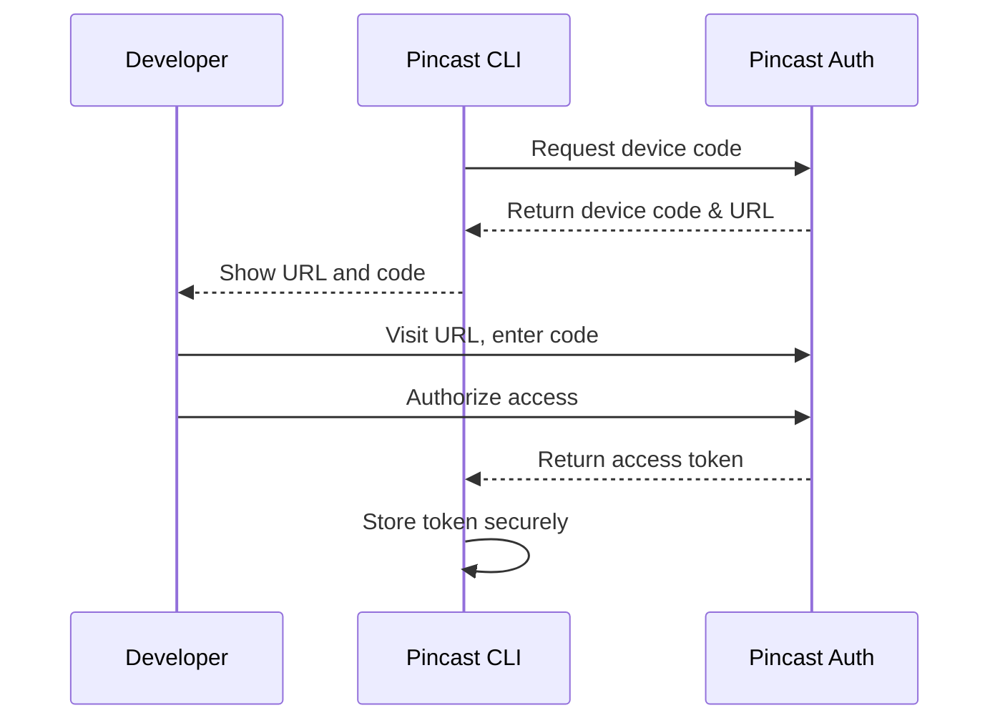
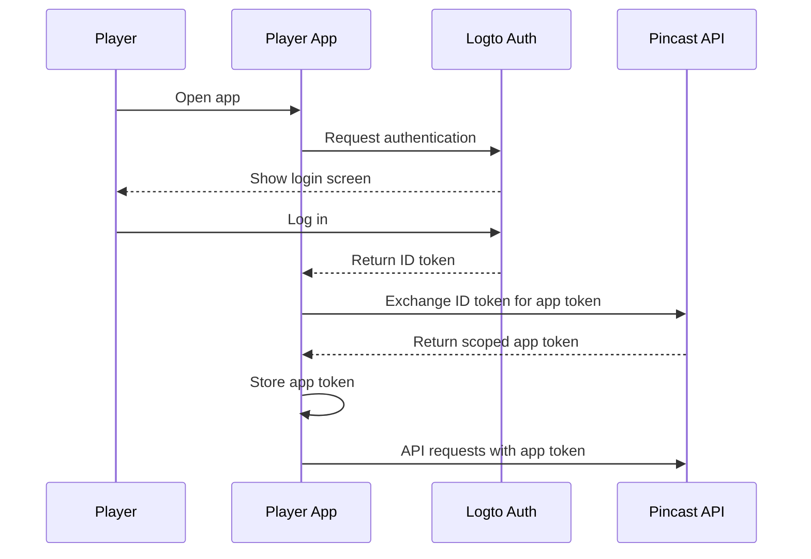

# Authentication in Pincast

Pincast uses a robust multi-tiered authentication system to secure both the development workflow and the player experience. This page explains how authentication works, from developer access to player sessions.

## Authentication Architecture

<div class="my-8">
  
</div>

Pincast's authentication system has three main components:

1. **Developer Authentication** - For CLI access and app deployments
2. **App Authentication** - For checking app authorization and permissions
3. **Player Authentication** - For player identity and progress tracking

## Developer Authentication (OAuth 2.0 Device Flow)

When you use the CLI or extension to log in, Pincast uses the OAuth 2.0 Device Flow:



### How to authenticate as a developer:

1. Run `pincast login` or use the VS Code extension
2. You'll be provided with a URL and device code
3. Open the URL in your browser
4. Enter the code and authorize the application
5. The CLI will store your token securely for future use

The token will be used for all operations that require developer authentication, such as deploying apps or accessing your account information.

## App Token Exchange

When a player uses your app, the SDK handles authentication and token exchange:



The app token is scoped specifically to your application, allowing players to interact with data only from your app.

## Developer Token

The developer token (`dev_token`) has the following properties:

- **Format**: JWT (JSON Web Token)
- **Issuer**: `auth.pincast.fm`
- **Subject**: Developer's unique ID
- **Audience**: `pincast:api:dev`
- **Scopes**: Permissions to deploy, update, and manage apps
- **Expiration**: 30 days (refreshable)

Example token payload:

```json
{
  "iss": "auth.pincast.fm",
  "sub": "user:123e4567-e89b-12d3-a456-426614174000",
  "aud": "pincast:api:dev",
  "exp": 1634567890,
  "iat": 1631975890,
  "scopes": ["deploy:apps", "read:apps", "update:apps"],
  "name": "Developer Name",
  "email": "dev@example.com"
}
```

## App Token

The app token has the following properties:

- **Format**: JWT
- **Issuer**: `auth.pincast.fm`
- **Subject**: Player's unique ID
- **Audience**: `app:{app_id}` (specific to your app)
- **Scopes**: Read/write access to app-specific data
- **Expiration**: 1 hour (refreshable)

Example token payload:

```json
{
  "iss": "auth.pincast.fm",
  "sub": "user:abcdef12-3456-7890-abcd-ef1234567890",
  "aud": "app:9876543f-edcb-4321-abcd-ef1234567890",
  "exp": 1634571490,
  "iat": 1634567890,
  "app_id": "9876543f-edcb-4321-abcd-ef1234567890",
  "player_id": "abcdef12-3456-7890-abcd-ef1234567890",
  "scopes": ["data:read", "data:write"]
}
```

## Authentication Flow in Code

Here's how authentication works in the SDK:

```typescript
import { useAuth } from '@pincast/sdk'

// Initialize authentication
const auth = useAuth()

// Check if user is authenticated
if (auth.isAuthenticated.value) {
  // User is already authenticated
  console.log('User ID:', auth.userData.value.sub)
  
  // Get token for API requests
  const token = await auth.getToken()
  
  // Make authenticated request
  const response = await fetch('/api/data', {
    headers: {
      'Authorization': `Bearer ${token}`
    }
  })
} else {
  // Redirect to login
  auth.login()
}
```

## Security Best Practices

When building Pincast apps, follow these security best practices:

1. **Never store tokens in localStorage** - The SDK handles token storage securely
2. **Always validate tokens on the server** - Check the audience and scopes
3. **Use HTTPS for all communication** - The SDK enforces this automatically
4. **Implement proper data validation** - Validate all user input
5. **Follow the principle of least privilege** - Only request the permissions you need

## Authentication Errors

Common authentication errors and how to resolve them:

| Error | Description | Resolution |
|-------|-------------|------------|
| `token_expired` | Token has expired | The SDK will refresh the token automatically |
| `invalid_token` | Token is invalid | Log out and log in again |
| `insufficient_scope` | Token lacks required scopes | Request missing permissions or contact support |
| `unauthorized_client` | App is not authorized | Make sure your app is registered and approved |

## Player Identity

Players on the Pincast platform maintain a consistent identity across all apps:

- Each player has a unique ID
- Profile data (name, avatar) is shared across apps
- Players can manage their data privacy in the Pincast player portal
- App-specific progress and data is isolated to each app

### Accessing Player Data

You can access basic player information in your app:

```typescript
const auth = useAuth()

// Basic player info
const playerId = auth.userData.value.sub
const playerName = auth.userData.value.name
const playerEmail = auth.userData.value.email
const playerPicture = auth.userData.value.picture

// Custom player data (if available)
const playerPreferences = auth.userData.value.custom_data
```

## Next Steps

- [SDK Authentication](/sdk/auth) - Learn how to use the authentication composable
- [Data Storage](/concepts/data-storage) - Understand how to store player data securely
- [Deployment](/cli/deploy) - Learn how to deploy your authenticated app